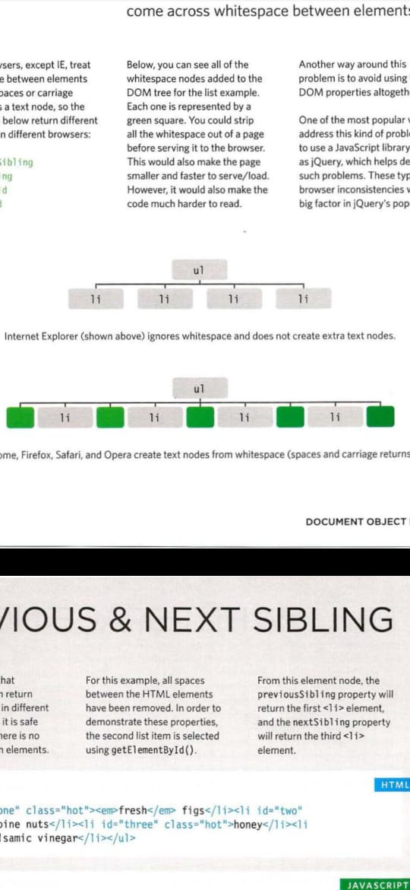
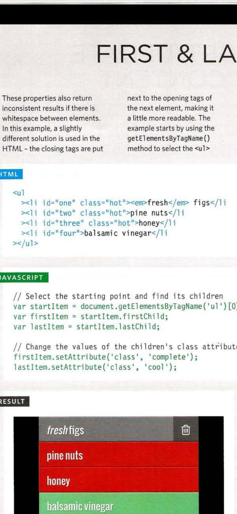

### *Object...
 A set of properties and methods that represent the model of something. 
 *Simple example :*  
*Rectangle/width/height/area* 
**Rectangle**: is an object that has two properties 1-width,2-Height and one method (area) which is responsible for calculating the area of this rectangle JS an object can be created by : 
-   object literal notation.
-   Object constructor notation.

In object constructor notation you can create an instance of the object.

### *Document object model (DOM)...

When the browser loads it creates an object model of HTML elements. It has a dom tree that tells the browser how to structure the elements ..This dom tree data structure contains  
Document node: which contains the whole HTML page  
Attribute nodes:which contains HTML elements  
Text nodes: which contains the values of attributes  
The dom tree can be accessed via javascript built-in method *example  :*
If you add an empty paragraph in HTML and you want to add content to it through js, the js will add this content to the text node in the dom tree. So if you look at your HTML file it will still empty but if you look at the dom tree it will have the newly added content and the browser will show the newly added content as the browser converts the HTML file to the dom tree then render it. Note: js give us multi-methods to access Html elements through the dom tree such as (getElementsByTagName()), these methods are called **dom queries.** some dom queries return more than one elements the returned value called(node list) ex: if you target all HTML elements in your HTML code(getElementsByTagName(p)) this will return all paragraphs and save them in the node list, you can access it by using item method ((getElementsByTagName(p).item(0)) this will return the first paragraph.

**Traversing the dom:** is a way to access the parent or the next element directly but this may cause an issue because if you have space btw elements most browsers add the whitespace as a node element so it may target them instead of targeting the next direct element.  

*See the below screenshot that describes the problem in the dom tree* 

 
*See the below screenshot that describes workaround solution* that adds the closing tag next to the new opening tag(without newline) to avoid adding a whitespace.

\
&nbsp;
**Untrusted data:** is any data that the user can add (control)Cross-site scripting (XSS) is when any user adding malicious codes in any field that has control over it. One way of defending against XSS is to validate data and limit what user can add.

### *The problem domain ...

*Problem domain* is the hardest part as you need to understand the idea of it  and how it works and how your software solution is going to be helpful for it, before writing your code, the problem is it's not easy to understand it, for example 
- you may face understanding the requirements wrongly or misunderstand the problem,(requirements) or having less information this is possible, especially that if you know nothing about the problem or let's say the product you want to make a system for it. (software prototype) may help in this case.
- to start building the system you should understand the problem domain one of the techniques is dividing the problem and understand each part individually so you become familiar with the whole problem.

\
&nbsp;

***References :***
 \
[https://security.stackexchange.com/questions/170900/what-is-untrusted-data/170906](https://security.stackexchange.com/questions/170900/what-is-untrusted-data/170906)
\
[https://youtu.be/--9K2-fz7ag](https://youtu.be/--9K2-fz7ag)
\
[https://dzone.com/articles/understanding-problem-domain](https://dzone.com/articles/understanding-problem-domain)
\
Duckett JS book